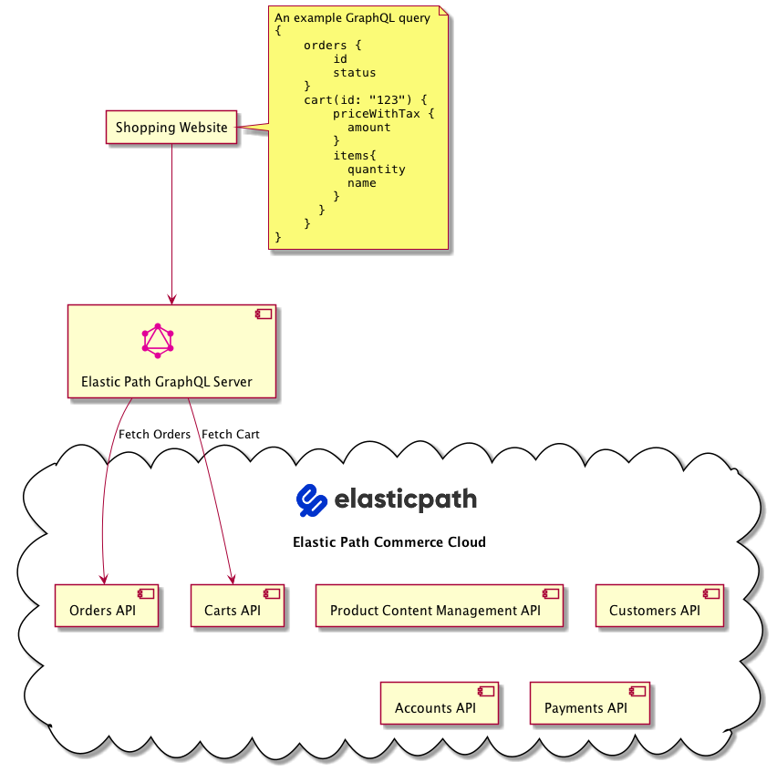

# GraphQL Server for Elastic Path Commerce Cloud

[Elastic Path](https://www.elasticpath.com/) is a composable, API-first, headless commerce platform. This project provides a [GraphQL](https://graphql.org/) abstraction for a subset of Elastic Path Commerce Cloud APIs to support shopping experiences. APIs that are used for store administration are not included in this project. This code uses [Apollo Server](https://www.apollographql.com/docs/apollo-server/getting-started/).

Contributors welcome 👋

## Pre-requisites

This requires an [Elastic Path Commerce Cloud](https://www.elasticpath.com) account.

## Architecture

This GraphQL server can be hosted anywhere by an Elastic Path customer. For each GraphQL query it makes one or more REST calls to Elastic Path Commerce Cloud. The diagram below shows one example query execution.


## Installation

```bash
git clone https://github.com/elasticpath/elasticpath-graphql-server
cd elasticpath-graphql-server
yarn
```

You will need to set a few environment variables inside.

Copy the `.env.example` file to create a `.env` file and fill in appropriate values.

Alternatively, `export` the envionment variables in your shell. Consult the `.env.example` file to determine which envirornment variables are needed.


```bash
export ELASTICPATH_API_HOST=
export ELASTICPATH_CLIENT_ID=
```

> **Note**: If you have both `.env` file and also exported the variables in your terminal, the values from the terminal will take precedence.


## Development

Starting the development server is easy.

```bash
yarn dev
```

Development uses [nodemon](https://github.com/remy/nodemon) which automatically reloads code after changes.

Visit [http://localhost:4000/](http://localhost:4000/) where you will be able to perform queries using [GraphQL Playground](https://github.com/graphql/graphql-playground).

## Linting

This repo uses the prettier for Linting, to check it you can use this command:
```bash
yarn prettier-check
```

To fix the prettier errors automatically, you can use this command:
```bash
yarn prettier-fix
```

## Authentication

Elastic Path Commerce Cloud APIs expect certain headers to be set e.g. `Authorization` header to identify the end user. This GraphQL server will pass these along to Elastic Path Commerce Cloud if they are provided in the request to the GraphQL server.

Please consult Elastic Path Commerce Cloud [documentation](https://documentation.elasticpath.com/commerce-cloud/docs/api/basics/authentication/index.html) on which headers might be needed. The below snippet lists some headers used as an example.

```
{
   "Authorization": "Bearer <implicit access token>",
   "X-MOLTIN-CUSTOMER-TOKEN": "<customer token>",
   "EP-Account-Management-Authentication-Token": "<account management authentication token>",
   "EP-Beta-Features": "<list of beta features>"
}
```

### Your First GraphQL Queries

1. Get an implicit token

```graphql
mutation {
  authenticate(client_id: "<your client id>") {
    access_token
    expires
  }
}
```
Set the `access_token` from the response as a Bearer token for subsequent requests.

2. Get a customer token
```graphql
mutation {
    authenticateAsCustomerViaPassword (email: "<email of an existing customer>", password: "<the customer's password>") {
        type
        id
        customer_id
        token
        expires
    }
}
```
Set the `token` from the response as the `X-MOLTIN-CUSTOMER-TOKEN` for subsequent requests.

3. Fetch hierarchies and nodes from a published catalog

```graphql
{
    hierarchies {
        id
        type
        attributes {
            name
            description
        }
    }

    nodes {
        id
        type
        attributes {
            name
            description
        }
        children {
            attributes {
                name
                description
            }

        }
        products {
            attributes {
                name
                description
                sku
            }
        }
    }
}
```

## Testing

This project uses postman collection to handle testing. We can run the tests on the command-line using newman so it is easy to incorporate those tests in CI. To run the test using terminal:

1. Start the graphql server: `yarn dev`
2. While the dev server is running, in another terminal run test: `yarn test`
  - Test reports will be geneated in `build/reports/` directory

Alternatively, run the postman collection using Postman app:

1. Start the graphql server: `yarn dev`
2. Import the `postman` directory into Postman app
3. Set `ELASTICPATH_CLIENT_ID` in the global environment variable with appropriate value
4. Run collection

### Adding to the tests

By default postman collections run in the order of the collection. In order to control test order we use postman's `setNextRequest` to create a workflow.
When adding new apis and tests, make sure to add them into the workflow appropriately and to not break the chain.

Postman can help generate a collection for us based on our schema, doing so we can import differences when we make changes.
The existing postman collection including tests are checked into the project under `postman` directory.

#### Generating the new collection

When you make a schema change, you can do the following to generate a postman collection:

1. In postman create new `API` and select schema type as `GraphQL` with format `GraphQL SDL`. (One-time step)
1. Under `Define` tab, update the schema with the contents of `schema.graphql`
1. Click on `Generate Collection` giving it a name and selecting `Test the API` to create a Test suite collection.

#### Adding to the existing collection

You can do this in one of two ways:

1. Manually, by adding in any changes or new postman requests to the existing collection.
   1. Copy any changes from the new collection into the existing collection
      - If we added a new query, we will have new requests to add to the collection
      - If we modified existing types, an existing request needs to be updated
   1. Add or fix the postman tests into the existing collection.
   1. Export your modified collection back to the project and add it to git.

1. Using a diff/merge tool
   1. Using IntelliJ, compare the new collection with the existing one.
   1. Merge any differences in the new file back to the existing collection.
   1. Import the collection into Postman.
   1. Add new tests to any new APIs, make sure to use the `setNextRequest` to add your tests into the current workflow.
   1. Using the options on the collection you can `Run the collection` which will execute all of the tests.
   1. Once all tests are passing, export your updated collection and save it back into the project.

The workflow using `setNextRequest` allows us to control order of tests, to do things such as:
1. Get all products, storing the id of a product
1. Getting a product by previously stored id.

For an example of tests, check out `products` and `product` within the Postman Collection.

## Build & Deploy

To build the server:

1. Run `yarn build` and you'll have output in the `build/dist/` directory
2. Run `yarn start` to run the server locally from that built output

Deploying the server can be done in various ways. Checkout the [Apollo Documentation on deployment](https://www.apollographql.com/docs/apollo-server/deployment/) for suggestions on how to deploy it several cloud hosting services.

Alternatively, you can copy the build output and host it yourself in a dedicated machine with NodeJS installed.

Another alternative is to deploy in a kubernetes cluster by building a docker image:

- Build the server first: `yarn build`
- Build the docker image: `docker build --tag epcc-graphql --file Dockerfile .`
- Run the docke image with necessary configurations: `docker run --detach --name epcc-graphql -p 8000:4000 --env ELASTICPATH_API_HOST=api.moltin.com epcc-graphql`
- GraphQL playground and apis should now be available at `localhost:8000/`
